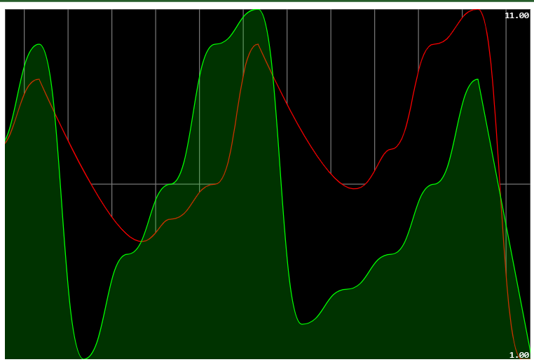

# 🍃 Spring Cloud Streams & Kafka 

## Table of Contents
1. [Project Description](#project-description)
2. [Project Structure](#project-structure)
3. [Getting Started](#getting-started)
    - [Downloading Kafka](#downloading-kafka)
    - [Docker Setup](#docker-setup)
4. [Spring Cloud Streams Services](#spring-cloud-streams-services)
    - [Service Producer](#service-producer)
    - [Service Consumer](#service-consumer)
    - [Service Supplier](#service-supplier)
    - [Data Analytics with Kafka Streams](#data-analytics-with-kafka-streams)
5. [Web Application](#web-application)
6. [Project Directory Structure](#project-directory-structure)
7. [Dependencies](#dependencies)
8. [Screenshots](#screenshots)

## Project Description
This project aims to demonstrate real-time data analytics using Kafka and Spring Cloud Streams. It includes the setup of Kafka, a set of Spring Cloud Streams services, and a web application to visualize real-time analytics results.

## Getting Started


### Downloading Kafka

To get started, download Kafka and follow these steps:
1. Start Zookeeper:
```
bin\windows\zookeeper-server-start.bat config\zookeeper.properties
```
2. Start Kafka Server:
```
bin\windows\kafka-server-start.bat config\server.properties
```
3. Create a console consumer and supplier for test
```
    start bin\windows\kafka-console-consumer.bat --bootstrap-server localhost:9092 --topic R1
    start bin\windows\kafka-console-producer.bat  --broker-list localhost:9092 --topic R1
```

*KAFKA Console Test*

### Docker Setup


## Spring Cloud Streams Services
### 1. Creating a java spring consumer
```java
@Bean
public Consumer<PageEvent> pageEventConsumer() {
  return (input) -> {
      System.out.println("****************************");
      System.out.println(input.toString());
      System.out.println("****************************");
  };
}
```
- Application.properties Configuration
```
spring.cloud.stream.bindings.pageEventConsumer-in-0.destination=R1
spring.cloud.function.definition=pageEventConsumer
```

*Spring KAFKA Consumer*

### 2. Create a java spring supplier
```java
@Bean
public Supplier pageEventSupplier() {
  return () -> new PageEvent(
          Math.random() > 0.5 ? "P1" : "P2",
          Math.random() > 0.5 ? "U1" : "U2",
          new Date(),
          new Random().nextInt(9000));
}
```
- Application.properties configuration
```
spring.cloud.stream.bindings.pageEventSupplier-out-0.destination=R2
spring.cloud.function.definition=pageEventSupplier
spring.integration.poller.fixed-delay=100
```


*Spring KAFKA Supplier*

### 3. Create a java spring function that can supply and consume at the same time
```java
@Bean
public Function<PageEvent, PageEvent> pageEventFunction() {
  return (input) -> {
      input.setName(input.getName() + " (Modified)");
      input.setUser(input.getUser() + " (Modified)");
      return input;
  };
}
```
- Application.properties
```
spring.cloud.stream.bindings.pageEventFunction-in-0.destination=R1
spring.cloud.stream.bindings.pageEventFunction-out-0.destination=R3
spring.cloud.function.definition=pageEventFunction
```


*Spring KAFKA Supplier and Consumer*

### 4. A Kafka Streams function that filters and processes streaming data to count occurrences over 5-second windows and generate a new stream of results.
```java
@Bean
public Function<KStream<String, PageEvent>, KStream<String, Long>> kStreamFunction() {
   return (input) -> input
   .filter((k, v) -> v.getDuration() > 100)   // Keep just pages with viewer duration > 100
   .map((k, v) -> new KeyValue<>(v.getName(), 0L))
   .groupBy((k, v) -> k, Grouped.with(Serdes.String(), Serdes.Long()))
   .windowedBy(TimeWindows.of(Duration.ofSeconds(5)))
   .count(Materialized.as("page-count"))
   .toStream()
   .map((k, v) -> new KeyValue<>("=>" + k.window().startTime() + " - " + k.window().endTime() + " - " + k.key(), v));
}
```
- Application.properties
```
spring.cloud.function.definition=kStreamFunction
spring.cloud.stream.kafka.streams.binder.configuration.commit.interval.ms=1000
spring.cloud.stream.bindings.kStreamFunction-in-0.destination=R2
spring.cloud.stream.bindings.kStreamFunction-out-0.destination=R4
```


*Spring KAFKA Streaming*

### 5. Real-Time Data Analytics Web Service
Periodically retrieving and mapping data from a Kafka Streams windowed store.
```java
@GetMapping(path = "/analytics", produces = MediaType.TEXT_EVENT_STREAM_VALUE)
public Flux<Map<String, Long>> analytics() {
  return Flux.interval(Duration.ofSeconds(1)).map(sequence -> {
      Map<String, Long> stringLongMap = new HashMap<>();
      ReadOnlyWindowStore<String, Long> windowStore = interactiveQueryService.getQueryableStore("page-count", QueryableStoreTypes.windowStore());
      Instant now = Instant.now();
      Instant from = now.minusSeconds(5);
      KeyValueIterator<Windowed<String>, Long> fetchAll = windowStore.fetchAll(from, now);
      while (fetchAll.hasNext()) {
          KeyValue<Windowed<String>, Long> next = fetchAll.next();
          stringLongMap.put(next.key.key(), next.value);
      }
      return stringLongMap;
  }).share();
}
```

### 6. Web Application for Displaying Stream Data Analytics Results
To explore the frontend application's repository for real-time data analytics visualization, please visit: [Frontend Repository](https://github.com/Slimani-CE/real-time-streaming-front-end).
